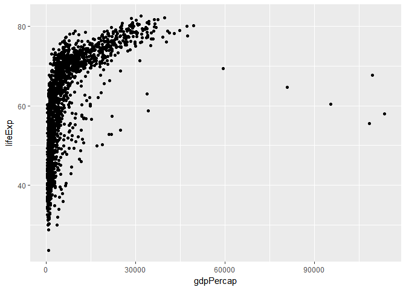

R tidyverse workshop
================
`Carpentry@UiO`
2018-02-15

*Read more about this type of document in [Chapter 20 of “Happy Git with
R”](http://happygitwithr.com/r-test-drive.html)*

Uncomment the following lines to install necessary packages

``` r
#install.packages("tidyverse")
#install.packages("maps")
#install.packages("gapminder")
```

First we need to load libraries installed previously

``` r
library(tidyverse)
```

    ## -- Attaching packages ----------- tidyverse 1.2.1 --

    ## v ggplot2 2.2.1     v purrr   0.2.4
    ## v tibble  1.4.2     v dplyr   0.7.4
    ## v tidyr   0.8.0     v stringr 1.2.0
    ## v readr   1.1.1     v forcats 0.2.0

    ## -- Conflicts -------------- tidyverse_conflicts() --
    ## x dplyr::filter() masks stats::filter()
    ## x dplyr::lag()    masks stats::lag()

We will source `gapminder` dataset into the session and assign it to the
variable with the same name

``` r
gapminder <- gapminder::gapminder
```

Let’s make our first plot

``` r
ggplot(gapminder)+
  geom_point(mapping = aes(x=gdpPercap, y=lifeExp))
```

<!-- -->

Generally speaking ggplot2 syntax follows the template:

``` r
# ggplot(<DATA>) +
#   geom_<GEOM_FUNCTION>(mapping=aes(<AESTETICS>))
```

Let’s learn some more about `ggplot2` and its functions\!
